# Diagramme de classes

Vue d'ensemble des entités de domaine, des interfaces (DAO / providers) et des
services qui les orchestrent. Les interfaces sont ce qui permet de changer de
techno (MySQL→Postgres, Chroma→pgvector, SPECTER2→autre modèle) sans toucher au
reste du code.

```mermaid
classDiagram
    %% ===== DOMAIN =====
    class Abstract {
        +id: UUID
        +editionId: UUID
        +authorId: UUID
        +title: str
        +text: str
        +status: AbstractStatus
        +relevanceScore: float
        +embeddingId: str
        +submittedAt: datetime
    }

    class Edition {
        +id: UUID
        +name: str
        +theme: str
        +themeEmbeddingId: str
        +submissionOpensAt: datetime
        +submissionClosesAt: datetime
        +status: EditionStatus
    }

    class User {
        +id: UUID
        +email: str
        +fullName: str
        +role: UserRole
    }

    class Cluster {
        +id: UUID
        +editionId: UUID
        +label: str
        +keywords: list~str~
        +abstractIds: list~UUID~
    }

    class DuplicateFlag {
        +id: UUID
        +abstractIdA: UUID
        +abstractIdB: UUID
        +semanticScore: float
        +lexicalScore: float
        +status: ReviewStatus
        +reviewedBy: UUID
    }

    Abstract "many" --> "1" Edition : belongs to
    Abstract "many" --> "1" User : authored by
    Cluster "1" --> "many" Abstract : groups
    DuplicateFlag --> "2" Abstract : flags pair

    %% ===== DAO INTERFACES =====
    class AbstractDAO {
        <<interface>>
        +create(abstract) Abstract
        +getById(id) Abstract
        +listByEdition(editionId) list~Abstract~
        +updateStatus(id, status) void
    }

    class VectorStoreDAO {
        <<interface>>
        +upsert(vectorId, embedding, metadata) void
        +searchSimilar(embedding, topK) list~ScoredMatch~
        +delete(vectorId) void
    }

    class EditionDAO {
        <<interface>>
        +create(edition) Edition
        +getById(id) Edition
        +close(id) void
    }

    class UserDAO {
        <<interface>>
        +create(user) User
        +getByEmail(email) User
    }

    class ClusterDAO {
        <<interface>>
        +saveClusters(editionId, clusters) void
        +listByEdition(editionId) list~Cluster~
    }

    class EmbeddingProvider {
        <<interface>>
        +embed(text) Vector
        +embedBatch(texts) list~Vector~
    }

    %% ===== DAO IMPLEMENTATIONS =====
    class MySQLAbstractDAO
    class PostgresAbstractDAO
    class ChromaVectorStore
    class PgVectorStore
    class Specter2Provider
    class SentenceTransformerProvider
    class OpenAIEmbeddingProvider

    AbstractDAO <|.. MySQLAbstractDAO
    AbstractDAO <|.. PostgresAbstractDAO
    VectorStoreDAO <|.. ChromaVectorStore
    VectorStoreDAO <|.. PgVectorStore
    EmbeddingProvider <|.. Specter2Provider
    EmbeddingProvider <|.. SentenceTransformerProvider
    EmbeddingProvider <|.. OpenAIEmbeddingProvider

    %% ===== SERVICES =====
    class EmbeddingService {
        -provider: EmbeddingProvider
        +embed(text) Vector
    }

    class RelevanceService {
        +computeRelevance(abstractVector, themeVector) float
    }

    class RankingService {
        +getRanking(editionId) list~Abstract~
    }

    class DuplicateDetectionService {
        -vectorStore: VectorStoreDAO
        +findPotentialDuplicates(abstract) list~DuplicateFlag~
    }

    class ClusteringService {
        -optimizer: HyperparamOptimizer
        +clusterEdition(editionId) list~Cluster~
    }

    class HyperparamOptimizer {
        +optimize(embeddings) UMAPHDBSCANParams
    }

    class TopicLabeling {
        +labelCluster(abstracts) str
    }

    class AbstractService {
        -abstractDAO: AbstractDAO
        -vectorStore: VectorStoreDAO
        -embeddingService: EmbeddingService
        -relevanceService: RelevanceService
        -duplicateDetectionService: DuplicateDetectionService
        +submit(abstractInput) Abstract
    }

    class EditionService {
        -editionDAO: EditionDAO
        +createEdition(input) Edition
        +closeSubmissions(id) void
    }

    class DashboardService {
        -abstractDAO: AbstractDAO
        -clusterDAO: ClusterDAO
        +getSummary(editionId) DashboardSummary
    }

    class ClusteringJob {
        -clusteringService: ClusteringService
        -clusterDAO: ClusterDAO
        +run(editionId) void
    }

    EmbeddingService --> EmbeddingProvider : uses
    AbstractService --> AbstractDAO : uses
    AbstractService --> VectorStoreDAO : uses
    AbstractService --> EmbeddingService : uses
    AbstractService --> RelevanceService : uses
    AbstractService --> DuplicateDetectionService : uses
    AbstractService --> Abstract : creates
    DuplicateDetectionService --> VectorStoreDAO : uses
    DuplicateDetectionService --> DuplicateFlag : creates
    RankingService --> AbstractDAO : uses
    ClusteringService --> HyperparamOptimizer : uses
    ClusteringService --> TopicLabeling : uses
    ClusteringService --> VectorStoreDAO : uses
    ClusteringService --> Cluster : creates
    ClusteringJob --> ClusteringService : triggers
    ClusteringJob --> ClusterDAO : uses
    EditionService --> EditionDAO : uses
    DashboardService --> AbstractDAO : uses
    DashboardService --> ClusterDAO : uses
```

## Lecture rapide

- **Losanges d'implémentation** (`<|..`) : chaque interface DAO/Provider a
  aujourd'hui une implémentation concrète, et peut en recevoir une seconde
  (Postgres, pgvector) sans changer les classes de service.
- **`AbstractService`** est le point d'orchestration central de la soumission :
  il ne connaît que des interfaces, jamais MySQL, Chroma ou SPECTER2 directement.
- **`DuplicateFlag`** n'entraîne jamais d'action automatique : son `status`
  (`ReviewStatus`) ne change que via une action explicite d'un organisateur côté API.
